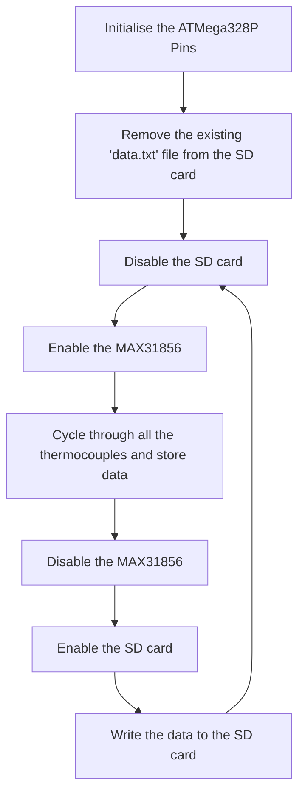

# Temperature Thing Firmware

    <i align="center">The firmware running the temperature sensing platform built for DRDO. 🌡️ </i>

    
    
     
    
    

___

## Contents
1. [Architecture of the Firmware](#architecture-of-the-firmware)
1. [Some important pointers about the firmware](#some-important-pointers-about-the-firmware)
1. [Functions in the Firmware](#functions-in-the-firmware)
1. [Continuous Integration Pipeline](#continuous-integration-pipeline)
1. [Authors and Reviewers](#authors-and-reviewers)
1. [License](#license)

## Architecture of the Firmware
This firmware was written to interface the ATMega328P with MAX31856 ADC.
All the underlying code is written in C++ and is built using the PlatformIO framework.
The main code loop heavily relies upon the custom built MAX31856 library which is 
covered in detail in the
[library documentation](https://github.com/spacebiz24/Thermal-Profiling/tree/main/Firmware/lib/MAX31856/).

The actions performed by this firmware are:
- Choose a specific thermocouple using the MUX
- Read the temperature from the MAX31856
- Write the temperature to the serial port and SD card in CSV format
- Repeat the process all over again

The following flow chart describes the overall working of the firmware.

## Some important pointers about the firmware
All board pins are defined in the beginning of the firmware and must not be changed
as long as hardware does not change. The `SWITCHING_DELAY_MS` defines the delay between
every thermocouple and is set to ensure appropriate time for the ADC readings to be stored
without any mix up.

### Functions in the Firmware
- `selectPin(int Pin_Number)`
    - This function is used to select a specific pin using the MUX.
    - Parameters:
        - `Pin_Number`: The pin number to be selected on the MUX.
    - Returns:
        - None
- `readSingleThermocouple(int Thermocouple_Number)`
    - This function is used to read the temperature from a single thermocouple.
    It selects a thermocouple by invoking the `selectPin()` function and then reads
    the temperature from the MAX31856.
    - Parameters:
        - None
    - Returns:
        - None
- `cycleThroughThermocouples()`
    - This function is used to cycle through all the thermocouples and store the data.
    - Parameters:
        - None
    - Returns:
        - None

The `setup()` function in the firmware initialises all the pins and their directions by using the
`BOARD_PINS` and `MUX_PINS` arrays which are defined in the beginning of the firmware.
The `BOARD_PINS_DIR` array defines the direction of the pins in the `BOARD_PINS` array.
The same is not needed for `MUX_PINS` as all the pins are set as `OUTPUT`.

The `setup()` function also removes the existing data file from the SD card to ensure that new data
is always written every time. It also initialises serial communication.

The `loop()` function follows all the steps as described in the flow chart above and calls the
`cycleThroughThermocouples()` function to cycle through all the thermocouples before writing
the same data to the SD card along with the time stamp to allow easier logging.

## Continuous Integration Pipeline
The firmware is built using the PlatformIO framework and is tested using the GitHub Actions CI pipeline.
The pipeline is triggered on every push to the repository and runs the firmware on a virtual environment
and the same is configured using the `.github/workflows/main.yml` file.

## Authors

<figure>
    
</figure>

## Reviewers

<figure>
    
</figure>
<figure>
    
</figure>

## License
As most of the project except the SD card library is custom developed,
without prior written permission of the author, this code must not be
reproduced, displayed, modified or distributed. The SD card library is
not covered under the above license. For more information, please refer
to the LICENSE file in the root directory of the repository.

___

Made with :heart: by [spacebiz24](https://github.com/spacebiz24)
