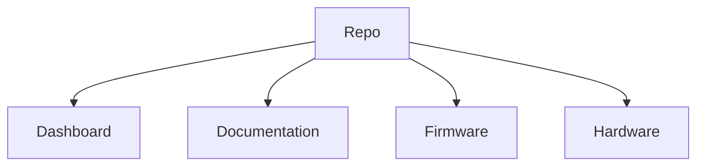

# Thermal Profiling on Fabrics

This repository is divided into the following sections:

Each section explains more about itself in its own `README.md` file. Please look into them.
___
Made with :heart: by [spacebiz24](https://github.com/spacebiz24), [DivakarGC](https://github.com/DivakarGC), [Eloquencere](https://github.com/Eloquencere), [Tejas-M-Nayak](https://github.com/Tejas-M-Nayak) and [L-o-n-e-W-o-l-f](https://github.com/L-o-n-e-W-o-l-f)
